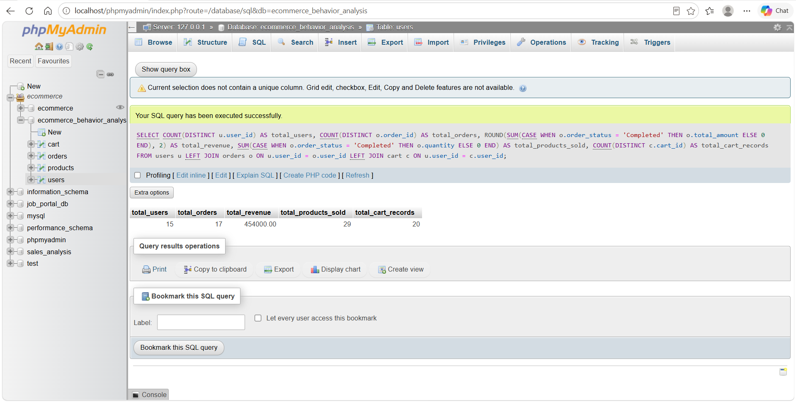
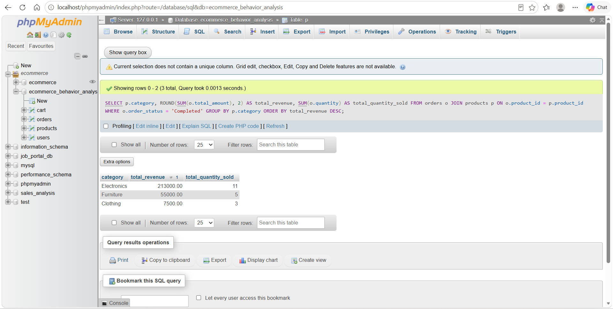
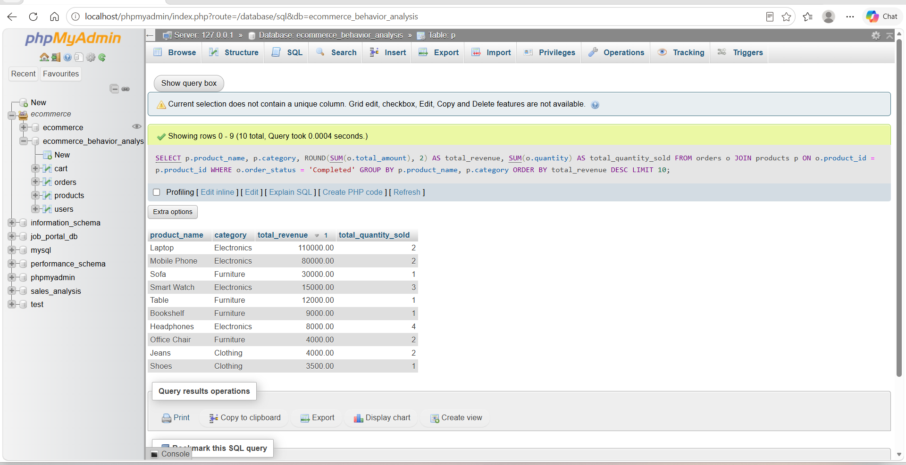
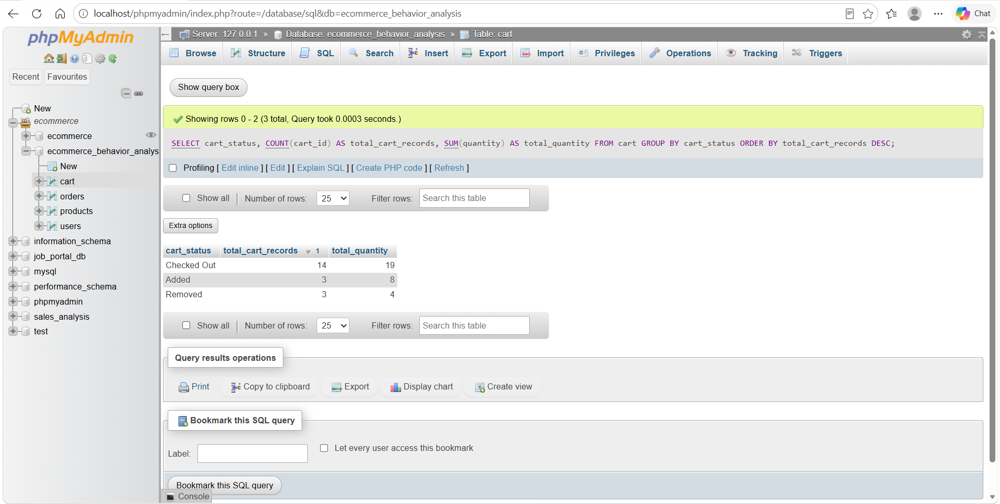
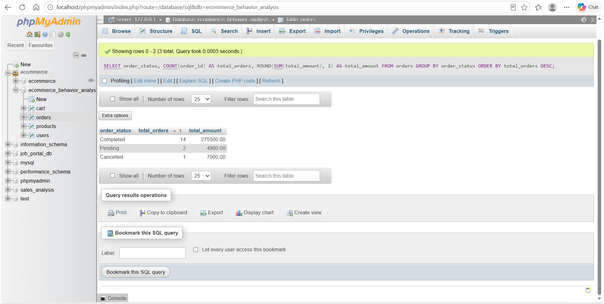
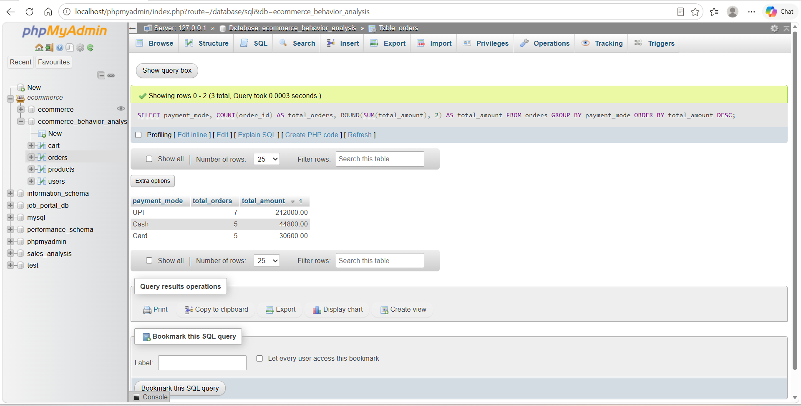
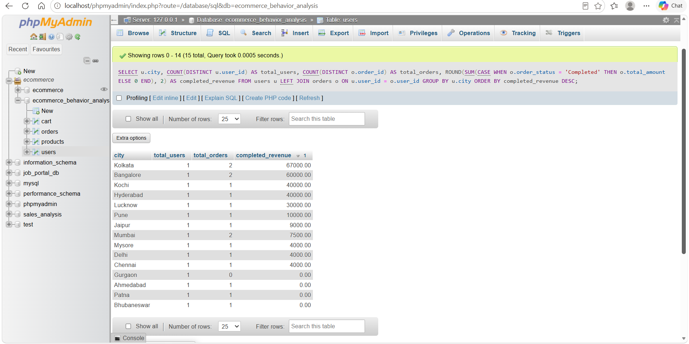
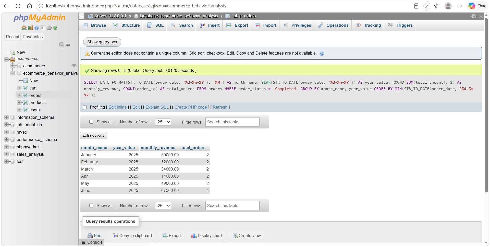

# E-Commerce Sales & User Behavior Analysis

## Project Overview

E-Commerce Sales & User Behavior Analysis is a data analytics project created to analyze customer activity, product sales, cart behavior, order status, payment modes, and revenue performance.

This project uses Microsoft Excel for dataset preparation, MySQL/phpMyAdmin for SQL-based analysis, and Power BI for dashboard visualization. The main objective is to understand e-commerce business performance using key metrics such as total users, total orders, total revenue, products sold, cart records, monthly revenue trend, product category revenue, top products, payment modes, and cart status.

---

## Tools and Technologies Used

- Microsoft Excel
- SQL
- MySQL
- phpMyAdmin
- XAMPP
- Power BI
- GitHub

---

## Dataset Details

This project contains four datasets:

### 1. Users Dataset

The users dataset contains customer details.

Columns:

- user_id
- user_name
- gender
- city
- registration_date

### 2. Products Dataset

The products dataset contains product information.

Columns:

- product_id
- product_name
- category
- price
- stock_quantity

### 3. Orders Dataset

The orders dataset contains customer order details.

Columns:

- order_id
- user_id
- product_id
- quantity
- order_date
- payment_mode
- order_status
- total_amount

### 4. Cart Dataset

The cart dataset contains cart activity details.

Columns:

- cart_id
- user_id
- product_id
- quantity
- cart_date
- cart_status

---

## Key Features

- Created e-commerce datasets using Microsoft Excel
- Cleaned and prepared CSV files for analysis
- Imported users, products, orders, and cart data into MySQL using phpMyAdmin
- Created separate database tables for each dataset
- Performed SQL analysis using joins, grouping, filtering, aggregation, and date functions
- Built an interactive Power BI dashboard
- Analyzed revenue, product performance, cart behavior, order status, payment mode usage, and user activity
- Visualized business KPIs using cards, line charts, bar charts, column charts, and donut charts

---

## Dashboard KPIs

The Power BI dashboard includes the following KPI cards:

- Total Users
- Total Orders
- Total Revenue
- Products Sold
- Cart Records

---

## Dashboard Visuals

The Power BI dashboard includes:

- Monthly Revenue Trend
- Revenue by Product Category
- Top Products by Revenue
- Orders by Payment Mode
- Cart Status Analysis

---

## Dashboard Screenshot


---

## SQL Analysis Performed

The following SQL analyses were performed:

- Total users, total orders, total revenue, products sold, and cart records
- Revenue by product category
- Top products by revenue
- Cart status analysis
- Order status analysis
- Payment mode analysis
- User activity by city
- Monthly revenue trend

---

## SQL Queries

### 1. Total Summary

```sql
SELECT
    COUNT(DISTINCT u.user_id) AS total_users,
    COUNT(DISTINCT o.order_id) AS total_orders,
    ROUND(SUM(CASE WHEN o.order_status = 'Completed' THEN o.total_amount ELSE 0 END), 2) AS total_revenue,
    SUM(CASE WHEN o.order_status = 'Completed' THEN o.quantity ELSE 0 END) AS total_products_sold,
    COUNT(DISTINCT c.cart_id) AS total_cart_records
FROM users u
LEFT JOIN orders o ON u.user_id = o.user_id
LEFT JOIN cart c ON u.user_id = c.user_id;
```

### 2. Revenue by Product Category

```sql
SELECT
    p.category,
    ROUND(SUM(o.total_amount), 2) AS total_revenue,
    SUM(o.quantity) AS total_quantity_sold
FROM orders o
JOIN products p ON o.product_id = p.product_id
WHERE o.order_status = 'Completed'
GROUP BY p.category
ORDER BY total_revenue DESC;
```

### 3. Top Products by Revenue

```sql
SELECT
    p.product_name,
    p.category,
    ROUND(SUM(o.total_amount), 2) AS total_revenue,
    SUM(o.quantity) AS total_quantity_sold
FROM orders o
JOIN products p ON o.product_id = p.product_id
WHERE o.order_status = 'Completed'
GROUP BY p.product_name, p.category
ORDER BY total_revenue DESC
LIMIT 10;
```

### 4. Cart Status Analysis

```sql
SELECT
    cart_status,
    COUNT(cart_id) AS total_cart_records,
    SUM(quantity) AS total_quantity
FROM cart
GROUP BY cart_status
ORDER BY total_cart_records DESC;
```

### 5. Order Status Analysis

```sql
SELECT
    order_status,
    COUNT(order_id) AS total_orders,
    ROUND(SUM(total_amount), 2) AS total_amount
FROM orders
GROUP BY order_status
ORDER BY total_orders DESC;
```

### 6. Payment Mode Analysis

```sql
SELECT
    payment_mode,
    COUNT(order_id) AS total_orders,
    ROUND(SUM(total_amount), 2) AS total_amount
FROM orders
GROUP BY payment_mode
ORDER BY total_amount DESC;
```

### 7. User Activity by City

```sql
SELECT
    u.city,
    COUNT(DISTINCT u.user_id) AS total_users,
    COUNT(DISTINCT o.order_id) AS total_orders,
    ROUND(SUM(CASE WHEN o.order_status = 'Completed' THEN o.total_amount ELSE 0 END), 2) AS completed_revenue
FROM users u
LEFT JOIN orders o ON u.user_id = o.user_id
GROUP BY u.city
ORDER BY completed_revenue DESC;
```

### 8. Monthly Revenue Trend

```sql
SELECT
    DATE_FORMAT(STR_TO_DATE(order_date, '%d-%m-%Y'), '%M') AS month_name,
    YEAR(STR_TO_DATE(order_date, '%d-%m-%Y')) AS year_value,
    ROUND(SUM(total_amount), 2) AS monthly_revenue,
    COUNT(order_id) AS total_orders
FROM orders
WHERE order_status = 'Completed'
GROUP BY month_name, year_value
ORDER BY MIN(STR_TO_DATE(order_date, '%d-%m-%Y'));
```

---

## SQL Output Screenshots

### Total Summary



### Revenue by Product Category



### Top Products by Revenue



### Cart Status Analysis



### Order Status Analysis



### Payment Mode Analysis



### User Activity by City



### Monthly Revenue Trend



---

## Project Folder Structure

```text
E-Commerce-Sales-User-Behavior-Analysis/
│
├── dataset/
│   ├── users.csv
│   ├── products.csv
│   ├── cart.csv
│   └── orders.csv
│
├── sql/
│   └── ecommerce_analysis_queries.sql
│
├── dashboard/
│   └── ecommerce_behavior_dashboard.pbix
│
├── screenshots/
│   ├── dashboard_home.png
│   ├── 01_sql_total_summary.png
│   ├── 02_sql_category_revenue.png
│   ├── 03_sql_top_products.png
│   ├── 04_sql_cart_status.png
│   ├── 05_sql_order_status.png
│   ├── 06_sql_payment_mode.png
│   ├── 07_sql_city_activity.png
│   └── 08_sql_monthly_revenue.png
│
└── README.md
```

---

## Business Insights

- Electronics generated the highest revenue among product categories.
- Laptop and Mobile Phone were among the top revenue-generating products.
- UPI, Card, and Cash were used as payment modes.
- Cart behavior analysis shows how many products were added, removed, or checked out.
- Monthly revenue trend helps understand sales performance over time.
- City-wise user activity helps identify active customer locations.
- Order status analysis helps identify completed, pending, and cancelled orders.

---

## Conclusion

This project demonstrates a complete data analytics workflow from dataset creation and cleaning to SQL analysis and dashboard visualization.

It helps understand e-commerce sales performance and user behavior using structured datasets, SQL queries, and Power BI visuals.

---

## Author

**Arshiya Shaik**
